<div align="center">


<a href="https://linkedin.com/in/edson-baptista-finda"></a>
<a href="https://medium.com/@efinda"></a>
<a href="mailto:edsonbaptistafinda@gmail.com"></a>

</div>

---

## `➜ whoami`

```c
typedef struct s_swe {
    const char  *username, *origin;
    const char  *focus[3];
    const char  *cursus;
    const char  *rabbit_holes[5];
}   t_swe;

static const t_swe  efinda = {
    .username     = "efinda",
    .origin       = "Luanda, Angola 🇦🇴",
    .focus        = { "systems", "infrastructure", "security" },
    .cursus       = "42 Luanda — Common Core complete, level 12.2",
    .rabbit_holes = { "UNIX internals", "networking", "distributed systems",
                      "production environments", "performance" },
};
```

I started my journey in Software Engineering in 2024, and 42 Luanda is where I've been building my foundations in this area — through self-taught and peer-to-peer learning.

During the Common Core I worked on projects from several different niches of Software Engineering. The ones I enjoyed building the most were the ones related to systems programming, infrastructure and security, and that's why I'm now specializing in these areas.

Some of the projects I've worked on are available here on this profile — I hope you find something interesting.

---

## `➜ ls ~/projects`

Each directory opens a page with the full breakdown of that area — what every project is, and what it's built with.

<pre>
~/projects
├── <a href="https://github.com/3dsonnn/3dsonnn/blob/main/repos/network-and-web.md"><b>network-and-web/</b></a>     <i>4 projects</i>   servers, infrastructure, full-stack, offensive tooling
├── <a href="https://github.com/3dsonnn/3dsonnn/blob/main/repos/graphics.md"><b>graphics/</b></a>            <i>5 projects</i>   rendering, geometry, games on raw pixels
├── <a href="https://github.com/3dsonnn/3dsonnn/blob/main/repos/libraries.md"><b>libraries/</b></a>           <i>4 projects</i>   the foundations everything else links against
├── <a href="https://github.com/3dsonnn/3dsonnn/blob/main/repos/systems-and-tools.md"><b>systems-and-tools/</b></a>   <i>3 projects</i>   memory, parsing, evaluation tooling
└── <a href="https://github.com/3dsonnn/3dsonnn/blob/main/repos/piscines.md"><b>piscines/</b></a>            <i>2 projects</i>   the deep ends I jumped into
</pre>

---

## `➜ cat stack.txt`

Every bar reads **technology → the projects where I actually used it**. Each project chip is a link straight to that repository.

**Languages**

<a href="https://github.com/3dsonnn/Super-Libft"></a><a href="https://github.com/3dsonnn/ft_printf"></a><a href="https://github.com/3dsonnn/cub3D"></a><a href="https://github.com/3dsonnn/malloc"></a>

<a href="https://github.com/3dsonnn/webserv"></a><a href="https://github.com/3dsonnn/children-tamper-with"></a><a href="https://github.com/3dsonnn/CPP"></a>

<a href="https://github.com/3dsonnn/python"></a>

<a href="https://github.com/3dsonnn/ft_prodd"></a>

<a href="https://github.com/3dsonnn/minishell_tests_sheet"></a>

**Tools &amp; technologies**

<a href="https://github.com/3dsonnn/Inception"></a><a href="https://github.com/3dsonnn/ft_prodd"></a>

<a href="https://github.com/3dsonnn/my_mlx"></a><a href="https://github.com/3dsonnn/cub3D"></a><a href="https://github.com/3dsonnn/tetr"></a><a href="https://github.com/3dsonnn/snake"></a>

<a href="https://github.com/3dsonnn/webserv"></a><a href="https://github.com/3dsonnn/children-tamper-with"></a>

<a href="https://github.com/3dsonnn/minishell_tests_sheet"></a><a href="https://github.com/3dsonnn/malloc"></a>

<a href="https://github.com/3dsonnn/Super-Libft"></a><a href="https://github.com/3dsonnn/my_mlx"></a><a href="https://github.com/3dsonnn/ft_printf"></a>

<a href="https://github.com/3dsonnn/Inception"></a>

<a href="https://github.com/3dsonnn/Inception"></a>

<a href="https://github.com/3dsonnn/Inception"></a>

<a href="https://github.com/3dsonnn/Inception"></a>

<a href="https://github.com/3dsonnn/ft_prodd"></a>

<a href="https://github.com/3dsonnn/ft_prodd"></a>

<a href="https://github.com/3dsonnn/ft_prodd"></a>

<a href="https://github.com/3dsonnn/ft_prodd"></a>

<a href="https://github.com/3dsonnn/ft_prodd"></a>

<a href="https://github.com/3dsonnn/ft_prodd"></a>

<a href="https://github.com/3dsonnn/ft_prodd"></a>

<a href="https://github.com/3dsonnn/ft_prodd"></a>

---

## `➜ tail -f writing/`

I write about some of the things I find interesting the most in my learning journey.

<a href="https://medium.com/@efinda"></a>

<div align="center">




</div>

---

```console
$ hexdump -C footer
00000000  4d 61 64 65 20 69 6e 20  41 6e 67 6f 6c 61 0a     |Made in Angola.|
0000000f
$ _
```

<div align="center">

`muxima` — *heart*, in Kimbundu. Nothing here was built without one.

</div>